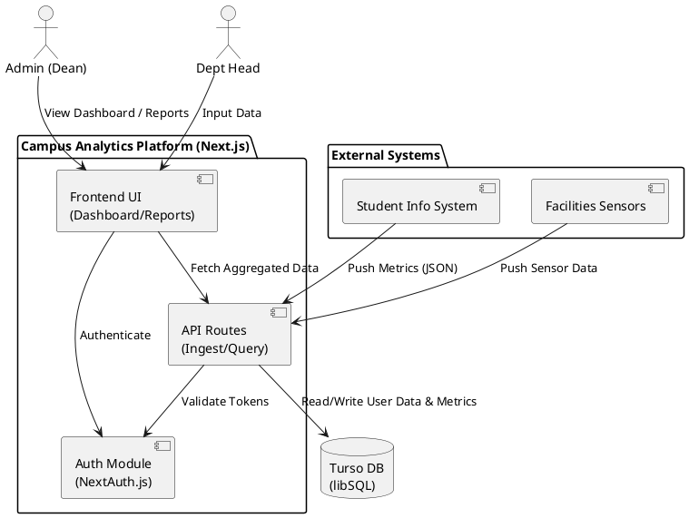

# Course Project – Deliverable I: Proposal & Checkpoint

**Name:** Jomar Thomas Almonte  
**Course:** SWENG 861 | Software Construction  
**Date:** January 25, 2026

---

## 1. Project Category & Title

**Category:** Campus Project Portfolio  
**Title:** Campus Analytics (Project R)

## 2. Problem & Users

**Problem Statement:**  
University administrators and department heads lack a unified, data-driven view of campus-wide trends. Currently, data related to enrollment, facilities usage, and student services operates in silos, making it difficult to correlate events (e.g., library usage vs. exam periods) or generate semester-level insights efficiently. This project aims to bridge that gap by aggregating metrics into a centralized dashboard for real-time analysis and reporting.

**Target Users:**

- **Dean/Administrators:** View high-level trends and generate strategy reports.
- **Department Heads:** Input or verify domain-specific data (e.g., Housing, Admissions).
- **System Services:** Automated ingest scripts feeding data into the platform.

## 3. Core Features

### Must-Have Features (MVP)

1.  **RBAC (Role-Based Access Control):** strict separation between authenticated Admins (who can configure sources/users) and Viewers (who can only see dashboards).
2.  **Centralized Analytics Dashboard:** a visual UI displaying aggregated key performance indicators (KPIs) from at least two distinct domains (e.g., Enrollment and Facilities).
3.  **Data Ingestion API:** a secure REST endpoint for external services to push metrics (e.g., `POST /api/metrics`).
4.  **Report Generation:** a workflow to compile selected metrics into a downloadable summary (PDF or JSON).

### Nice-to-Have Features

1.  **Alerting System:** email or in-app notifications when specific metrics exceed defined thresholds (e.g., "Dorm capacity > 95%").
2.  **External Visualization:** integration with a tool like Tableau or PowerBI Embedded for advanced charting.

## 4. Architecture & Tech Stack

### Architecture Sketch

**PlantUML Diagram:**

**Workflow:**

1.  **Ingest:** External systems push data to the **Next.js API Routes**.
2.  **Process:** API validates ownership, processes rules, and stores data in **Turso (libSQL)**.
3.  **Visualise:** **Next.js Frontend** fetches aggregated data for the Dashboard (SSR/CSR).
4.  **Report:** Backend generates reports upon Administrator request.

`Next.js (Fullstack) <---> Turso (Edge DB)`

### Tech Stack

**Languages:**

- **JavaScript:** Full-stack development (Next.js).
- **SQL:** Database queries.

**Frameworks & Libraries:**

- **Fullstack:** Next.js (App Router, JavaScript).
- **Styling:** TailwindCSS.
- **Auth:** NextAuth.js (or custom JWT).

**Data & Infrastructure:**

- **Database:** Turso (libSQL/SQLite at the Edge).
- **Containerization:** Docker.
- **CI/CD:** GitHub Actions.

---

## Part 2: GitHub Repository Setup

The project repository has been initialized to support this architecture.

**Link:** `https://github.com/psu-edu/sweng861-crud-jzt5803`  
_(Note: As per course flexibility, this repo serves as the foundation for the Capstone work)._

**Repo Contents:**

- `README.md`: Contains project title, description, and setup instructions.
- `.gitignore`: Configured for Node.js, protecting secrets and system files.
- `backend/`: Initial API structure.
- `Dockerfile`: Container configuration.
